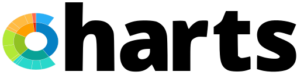

<p align="center">
  <a href="https://zaimea.com/#gh-light-mode-only" target="_blank">
    
  </a>
  <a href="https://zaimea.com/#gh-dark-mode-only" target="_blank">
    
  </a>
</p>
<p align="center">
  Apex Charts for Laravel.
<p>
<p align="center">
    <a href="https://github.com/zaimealabs/charts/actions/workflows/tests.yml"></a>
    <a href="https://github.com/zaimealabs/charts/blob/main/LICENSE"></a>
</p>
<div align="center">
  Hey 👋 thanks for considering making a donation, with these donations I can continue working to contribute to ZaimeaLabs projects.
  
  [](https://www.paypal.com/donate/?hosted_button_id=V6YPST5PUAUKS)
</div>

## Installation

```json
"repositories": [
        {
            "type": "vcs",
            "url": "https://github.com/zaimealabs/charts"
        }
    ]
```

```bash
composer require zaimealabs/charts
```

```bash
php artisan vendor:publish --tag=charts-config
```

```bash
php artisan vendor:publish --tag=charts-apexcharts-script
```

## Usage

In your controller add:
```php
$pie = Charts::pieChart()
    ->setDataset([150, 120])
    ->setTitle('Posts')
    ->setLabels(['Published', 'No Published']);
```

Remember to import the Facade to your controller with 
```php
use ZaimeaLabs\Charts\Facades\Charts;
```

Or importing the Charts class:
```php
use ZaimeaLabs\Charts\Charts;
```

In your Layouts (Blade file) add in <head>:
```php
    @chartsScripts
```

Then in your view (Blade file) add: 
Note: if you want the charts to be dynamic, use the syntax (eg: livewire:charts-area-chart) for livewire.
```php
<div>
    {!! $chart->container() !!}
</div>
```
or 
```php
<div>
    <livewire:charts-area-chart
        key="{{ $areaChartModel->reactiveKey() }}"
        :area-charts="$areaChartModel"
    />
</div>
```

You can use command to make charts
```php
php artisan make:charts ChartName
```

### More Example

```php
$donut = Charts::donutChart()
    ->addData([200, 240, 300])
    ->setTitle('Top 3 active users from group.')
    ->setSubtitle('Season 2024.')
    ->setLabels(['User 3', 'User 10', 'User 91']);
```

```php
$radial = Charts::radialChart()
    ->addData([4275, 105])
    ->setTitle('Work efficiency.')
    ->setSubtitle('How many working hours and sick leave a user has.')
    ->setLabels(['Worked', 'Sick leave'])
    ->setColors(['#D32F2F', '#03A9F4']);
```

```php
$line = Charts::lineChart()
    ->addData('Hours worked', [138, 138, 145, 145, 131, 82])
    ->addData('Hours expected', [138, 140, 138, 145, 134, 82])
    ->setTitle('Hours worked during 2024.')
    ->setSubtitle('Hours worked vs Hours expected.')
    ->setXAxis(['January', 'February', 'March', 'April', 'May', 'June']);
```

```php
$area = Charts::areaChart()
    ->addData('Hours worked', [138, 138, 145, 145, 131, 82])
    ->addData('Hours expected', [138, 140, 138, 145, 134, 82])
    ->setTitle('Hours worked during 2024.')
    ->setSubtitle('Hours worked vs Hours expected.')
    ->setXAxis(['January', 'February', 'March', 'April', 'May', 'June']);
```

```php
$bar = Charts::barChart()
    ->addData('User 3', [6, 9, 3, 4, 10, 8])
    ->addData('User 91', [7, 3, 8, 2, 6, 4])
    ->setTitle('User 3 vs User 91.')
    ->setSubtitle('Working hours during season 2024.')
    ->setXAxis(['January', 'February', 'March', 'April', 'May', 'June']);
```

### Customizing charts

Change chart colors dynamically
```php
    ->setColors(['#ffc63b', '#ff6384'])
```

Customize Fonts
```php
    ->setFontFamily('DM Sans')
    ->setFontColor('#ff6384')
```

Customize Chart Grid
```php
    ->setGrid(); // empty adds a default style
    ->setGrid('#3F51B5', 0.1);
```

Customize Chart Markers  
```php 
[#color1, #color2], $width , $hoverSize 
```
```php
    ->setMarkers(['#FF5722', '#E040FB'], 7, 10);
```

Set Sparkline
```php
    ->setSparkline()
```

Set Theme
```php
    ->setTheme('dark')
```

Set Toolbar
```php
    ->setToolbar(bool)
```

Set Tooltip
```php
    ->setTooltip(bool, 'dark/light')
```

Set Animations
```php
    ->setAnimations(bool)
```
